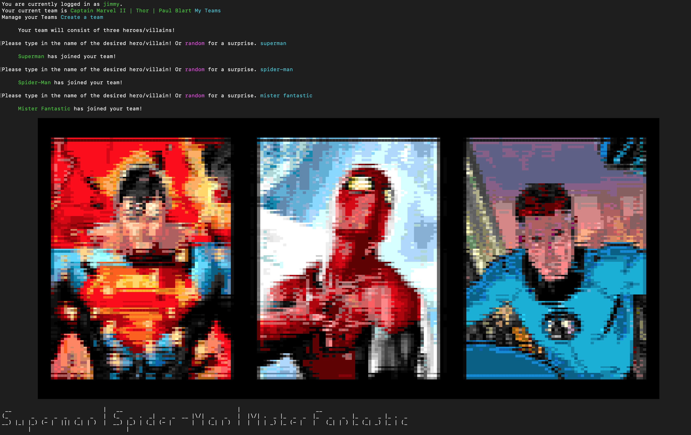

Superhero Battler by Nick & Jimmy
========================

Superhero Battler is a CLI application inspired by autobattler genre games, such as Teamfight Tactics, Auto Chess, and Dota Underlords. In Superhero Battler, players will create a team consisting of three superheroes/supervillains and battle with other players' teams to determine who has the best superhero team!

Superhero Battler uses the Superhero API for powerstats and images:  
https://superheroapi.com  
https://github.com/akabab/superhero-api

Notable gems used:  
[TTY/Pastel](https://ttytoolkit.org/) (especially TTY-prompt) for the fancy user interface  
[Catpix](https://github.com/pazdera/catpix) for printing superhero images in the terminal  
[RMagick/ImageMagick](https://github.com/rmagick/rmagick) for montaging superhero images and displaying them  
ActiveRecord/Sinatra/SQLite for the OO relationship DB magic  

---

## How to Install

1. Use Bundler to install the required gems.
```
bundle install
```
2. Run the rake task to seed the database with superhero data scraped from Superhero-API
```
rake db:seed
```
3. This repo does not include superhero images. If you wish to include superhero images, you can run the scraper in "load_superhero_fighters.rb" to download the images yourself. You will need to visit Superhero API to register an access token and replace the ```MyKey.new.superhero_key``` variable with your access token. Please note that some images are missing, as the links in Superhero API provides for those heroes are dead. 
```ruby
[*1..731].each do |number|
    begin
         download_images_by_id(number, number)
     rescue
         puts "missing #{number}"
     end         
 end
```
4. Run bin/run.rb and you'll be able to play! Please note that you can only battle superhero teams after multiple users/teams have been created.
```
ruby bin/run.rb
```
---

## Images





